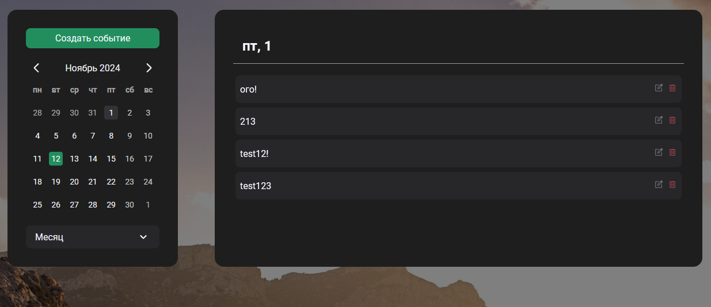

## Calendar

## Setup

1. Install PHP 8.0+
2. Set MySQL creds to /api/config.php file
3. Run server

## API

**prefix: /api**

**API doesn't have authorization!**

### Events

- GET /events/index.php

  Get list of all events

- GET /events/index.php?id=$ID

  Get event info about event with given ID

- POST /events/index.php

  Create a new event

- DELETE /events/index.php

  Delete a event with given ID
